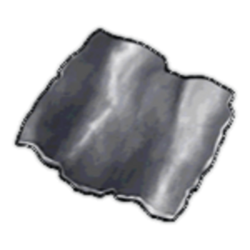

# About Me

Hi, my name is IronCrumb. I have been studying Cyber Security since I was 14, and I recently graduated with a Bachelors of Science in Cyber Security Engineering. During my time in school and out of it, I have worked at small government contrractors as well as fortune 100 companies. Over my time in school and in the corporate cyber security world, I've learned that it is important to give back to the cyber security community. Here I will share what I can about the things that I have learned along the way. 

Things I hope to share:
  1) Forensic things I find fun in a series called: Smoothbrain 4n6
  2) Little tips I learned while developing software
  3) resources to get started or advance yourself in the field of cyber security

I hope you enjoy the blog :)

